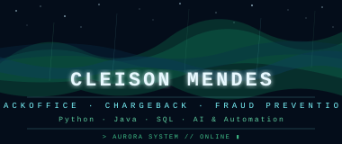

<div align="center">




</div>

<div align="center"></div>

## `01 // IDENTIDADE`

```python
cleison = {
    "nome": "Cleison Mendes",
    "area_atual": "BackOffice | Chargeback | Prevenção a Fraudes",
    "formacao": "Análise e Desenvolvimento de Sistemas",
    "foco": [
        "Desenvolvimento",
        "Automação",
        "Inteligência Artificial",
        "Dados",
        "Prevenção a Fraudes"
    ],
    "linguagens": ["Python", "Java", "SQL"],
    "mentalidade": "Codificar. Automatizar. Evoluir."
}
```

### 🌌 Aurora Tech

Minha identidade visual é inspirada na **Aurora Boreal**.

A aurora representa movimento, transformação e luz surgindo em meio à escuridão — uma metáfora para minha jornada na tecnologia: experiência, aprendizado contínuo e evolução constante.

> *"Uma pequena luz hoje pode iluminar grandes caminhos amanhã. ✨"*

<div align="center"></div>

## `02 // TECH_STACK`

### 🐍 Desenvolvimento

<div align="center">


</div>

### 🌐 Web

<div align="center">


</div>

### 📊 Dados

<div align="center">


</div>

### 🤖 IA & Automação

<div align="center">


</div>

### 🛠️ Ferramentas

<div align="center">


</div>

<div align="center"></div>

## `03 // TERMINAL`

```bash
╭──────────────────────────────────────────────╮
│              AURORA SYSTEM v1.0              │
╰──────────────────────────────────────────────╯

> Inicializando perfil de desenvolvedor...

[ OK ] Experiência profissional carregada
[ OK ] Módulos de automação carregados
[ OK ] Módulos de desenvolvimento carregados
[ OK ] Núcleo de IA carregado
[ OK ] Sistema antifraude em desenvolvimento

───────────────────────────────────────────────

FUNÇÃO       : BackOffice | Chargeback | Fraud Prevention
FORMAÇÃO     : Análise e Desenvolvimento de Sistemas
FOCO         : Desenvolvimento + Automação + IA
LINGUAGENS   : Python | Java | SQL
PROJETO      : FraudShield
STATUS       : ONLINE

───────────────────────────────────────────────

> Buscando próximo desafio...
> Sistema pronto. █
```

<div align="center"></div>

## `04 // PROJETO_EM_DESTAQUE`

<div align="center">

### 🛡️ FraudShield
**Motor Antifraude com Dados Reais**

Projeto desenvolvido para explorar Machine Learning, análise de dados e detecção de transações fraudulentas utilizando um dataset real de transações de cartão de crédito.

O projeto representa a união entre minha experiência profissional no segmento de **prevenção a fraudes e meios de pagamento** e minha evolução técnica em Python e Data Science.


```
Dataset: Credit Card Fraud Detection — ULB / Kaggle
284.807 transações | Legítimas + Fraudulentas
```


> *"Evoluindo o projeto para transformar experiência de negócio em um motor antifraude cada vez mais completo."*

<!-- Descomente quando subir para o GitHub:
[](https://github.com/CleisonMendes/fraudshield)
-->

</div>

<div align="center"></div>

## `05 // PROJETOS`

<div align="center">

| Projeto | Descrição | Stack | Status |
|---|---|---|---|
| 📊 **Aurora Invest** | CRM de Assessoria — dashboard de patrimônio, agenda e ranking | Python · SQL | 🚧 Em desenvolvimento |
| 🐟 **Sistema Aquícola** | Gestão de operações de piscicultura, organização de dados | Python | 📚 Estudo |
| ⚙️ **Automação de Processos** | Scripts e experimentos com Python e Selenium | Python · Selenium | 🧪 Experimentação |

</div>

<div align="center"></div>

## `06 // CURRENTLY_LEARNING`

```
┌─────────────────────────────────────────────┐
│             LEARNING PROTOCOL               │
├─────────────────────────────────────────────┤
│                                             │
│  🎓 Análise e Desenvolvimento de Sistemas  │
│                                             │
│  🐍 Python                                  │
│  ☕ Java                                    │
│  🗄️  SQL                                    │
│  🤖 Inteligência Artificial                 │
│  📊 Dados e Machine Learning                │
│  ⚙️  Automação                              │
│  🌐 Desenvolvimento Web                     │
│                                             │
└─────────────────────────────────────────────┘
```

*A jornada atual está concentrada em transformar conhecimento acadêmico e experiência profissional em projetos práticos de tecnologia.*

<div align="center"></div>

## `07 // PROFESSIONAL_BACKGROUND`

Minha trajetória profissional está ligada ao universo de **meios de pagamento, BackOffice, Chargeback, contestação e prevenção a fraudes**.

Essa experiência trouxe uma visão de negócio que hoje está sendo combinada com conhecimentos de programação, automação, dados e inteligência artificial.

```
NEGÓCIO
   │
   ├── Meios de pagamento
   ├── Chargeback
   ├── Contestação
   └── Prevenção a fraudes
          │
          ▼
      TECNOLOGIA
          │
          ├── Python
          ├── SQL
          ├── Java
          ├── Automação
          ├── Dados
          └── IA
          │
          ▼
      SOLUÇÕES
```

<div align="center"></div>

## `08 // GITHUB_METRICS`

<div align="center">


> *ℹ️ Os indicadores acima são gerados por um serviço externo e podem ficar temporariamente indisponíveis.*

</div>

<div align="center"></div>

## `09 // CONTRIBUTION_MATRIX`

<div align="center">


*As estatísticas refletem a atividade pública disponível no GitHub.*

</div>

<div align="center"></div>

## `10 // CONNECT`

<div align="center">

<a href="https://www.linkedin.com/in/cleison-mendes">
  
</a>
<a href="https://github.com/CleisonMendes">
  
</a>

</div>

<div align="center"></div>

<div align="center">

🌌 **CLEISON MENDES**

*Tecnologia é evolução.*

**BUILD • AUTOMATE • LEARN • EVOLVE**

✨ *Construindo hoje a tecnologia do amanhã.*

</div>
